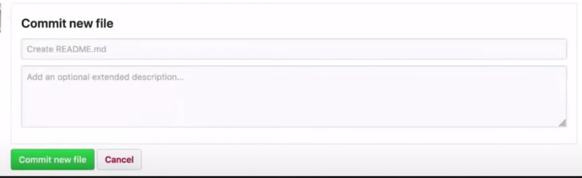
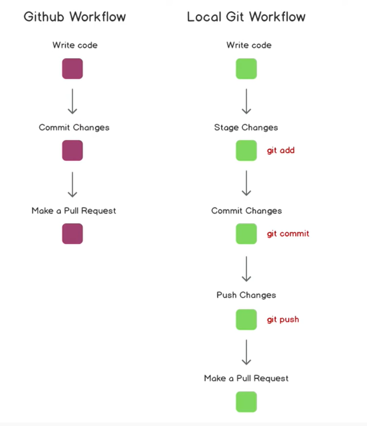

# Cloning a repository to a local machine

1. git clone git_url

# Checking the status of the git

1. git status

# Adding the changes in the local machine

1 git add .

- to add all the changes

2. git add folder_name/file_name

- to just add specific file/folder

# Commiting the changes on the local machine

1. git commit -m "Title description of the changes" -m "Detailed description of the changes"
   

- -m is message

# Commiting and adding at the same time.

1. git commit -am "Title description of the changes"

- only works for modified not untracked.

# Pushing the changes in local machine to cloud repo

1. git push origin branch_name

# Pulling the changes in the cloud repo to local machine

1. git pull origin branch_name

## Setting upstream so you didn't need to type origin branch_master every time doing a push

1. git push -u origin branch_name

- -u is upstream

# Starts a repo in your local machine

1. git init
2. git remote add origin git_url
3. git remote -v
4. git push origin branch_name

## Work flow

# Git Branching

## Create a new branch

1. git checkout -b branch_name

## Switching between different branches

1. git checkout branch_name

## Check difference between 2 branch

1. on master/main branch, git diff branch_name_to_be_compared

## Merging branches into master /projects

1. ideally, by making a pull request.
2. first push the feature_branch to the cloud.
3. by making a pull request to feature_branch -> master_branch
4. should be approved by the owner of the master branch.

## Merging updated master in local feature_branch

1. on feature_branch, git merge main/master_branch
2. delete some parts on the conflict codes.
3. then commit the changes in feature_branch
4. get merge main/master

- changes in master/main will be copied in feature_branch

## Deleting a branch

1. git branch -d branch_name

# Undoing git command

1. if add, git reset
2. if commit, git reset HEAD~1
3. if wanted to unstage a commit a point in time, git log and copy the hash
4. git reset hash_code_to_be_unstaged
5. Go back in time, git reset --hard hash_code_before_changes

# Forking

- copying a repository into your repository
